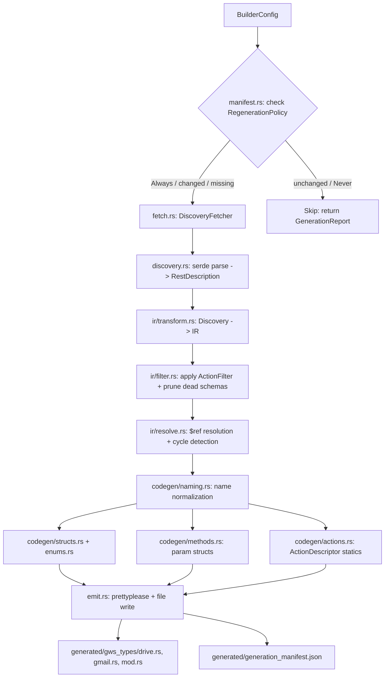
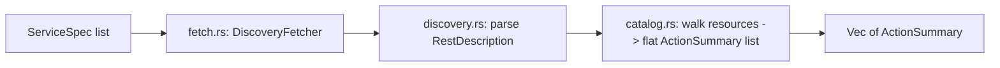

# gws-builder: Static Rust Codegen from Google Discovery Documents

## Context

The [Google Workspace CLI](https://github.com/googleworkspace/cli) handles Discovery documents **dynamically at runtime** -- it deserializes JSON into generic serde types and builds `clap::Command` trees on the fly. The `gws-builder` crate takes the opposite approach: it runs at **compile time** (inside `build.rs`) to produce static, strongly-typed Rust code from the same Discovery documents.

The Discovery document format is well-defined (see [Google Discovery Service](https://developers.google.com/discovery)). Each document contains:

- `schemas`: JSON Schema type definitions (structs, enums, maps, nested objects)
- `resources`: REST resources with `methods` containing HTTP verb, path template, parameters, request/response `$ref` links
- `parameters`: global query parameters
- `auth`: OAuth2 scope definitions

## Crate Layout

```
src/
  lib.rs           -- Public API (BuilderConfig, generate(), list_available_actions())
  error.rs         -- BuilderError with thiserror
  fetch.rs         -- Blocking HTTP fetch + directory resolution
  discovery.rs     -- Serde models for Discovery JSON (borrowed from GWS CLI)
  manifest.rs      -- generation_manifest.json read/write + RegenerationPolicy
  catalog.rs       -- list_available_actions() pre-generation introspection
  ir.rs            -- IR module root
  ir/
    types.rs       -- IR type definitions (IrSchema, IrField, IrMethod, IrEnum...)
    resolve.rs     -- $ref resolution, cycle detection, topological sort
    transform.rs   -- Discovery -> IR transformation
    filter.rs      -- ActionFilter application + dead schema pruning
  codegen.rs       -- Code generation module root
  codegen/
    structs.rs     -- Struct + field emission with serde derives
    enums.rs       -- String enum emission
    methods.rs     -- Method signature + endpoint metadata emission
    actions.rs     -- ActionDescriptor / ParamDescriptor static data emission
    naming.rs      -- camelCase->snake_case, Rust keyword escaping, collision detection
  emit.rs          -- File writing, prettyplease formatting, module tree
```

The crate type should be `lib` (not `bin`). Change `src/main.rs` to `src/lib.rs`.

### Generated Output Structure (Pattern B -- checked into source)

The downstream consumer's repository looks like:

```
my-agent-crate/
  src/
    main.rs          -- consumer code, uses `mod generated;`
  generated/
    gws_types/
      mod.rs         -- pub mod drive; pub mod gmail; ...
      drive.rs       -- types, enums, method descriptors, action descriptors
      gmail.rs       -- types, enums, method descriptors, action descriptors
      serde_helpers.rs -- string_to_i64, base64, etc.
    generation_manifest.json  -- revision tracking for skip/regen decisions
  build.rs           -- calls gws_builder::generate()
  Cargo.toml         -- [build-dependencies] gws-builder = ...
```

The generated code is committed to git, visible in the IDE (full autocomplete / go-to-definition), reviewable in PRs, and diffable. The `build.rs` is optional after the initial generation -- you can run it on demand or only when Discovery revisions change.

---

## Module 1: Public API ([`src/lib.rs`](src/lib.rs))

```rust
pub struct ServiceSpec {
    pub name: String,           // e.g. "drive"
    pub version: String,        // e.g. "v3"
    pub filter: ActionFilter,   // which actions to include
}

pub enum ActionFilter {
    /// Include all resources and methods.
    All,
    /// Include only methods matching these patterns.
    /// Patterns: "files.*", "files.list", "permissions.create"
    Whitelist(Vec<String>),
    /// Include everything except methods matching these patterns.
    Blacklist(Vec<String>),
}

pub enum RegenerationPolicy {
    /// Always fetch and regenerate, even if revisions match.
    Always,
    /// Fetch Discovery doc, compare `revision` field to manifest, skip if unchanged.
    IfChanged,
    /// Only generate when output files or manifest don't exist yet.
    IfMissing,
    /// Never fetch or generate. Error if output files don't exist.
    Never,
}

pub struct BuilderConfig {
    pub services: Vec<ServiceSpec>,
    pub out_dir: PathBuf,                                // e.g. "generated/gws_types"
    pub regeneration: RegenerationPolicy,                // default: IfChanged
    pub fetcher: Option<Box<dyn DiscoveryFetcher>>,      // injectable for testing
}

/// Run the full pipeline: fetch -> parse -> filter -> codegen -> emit.
/// Respects `regeneration` policy and `filter` per service.
pub fn generate(config: BuilderConfig) -> Result<GenerationReport, BuilderError> { ... }

/// Fetch Discovery docs and return a flat catalog of all available actions
/// without generating any code. Use this to inspect what's available before
/// choosing a whitelist.
pub fn list_available_actions(
    services: &[ServiceSpec],
    fetcher: &dyn DiscoveryFetcher,
) -> Result<Vec<ActionSummary>, BuilderError> { ... }

/// Returned by generate() so the caller knows what happened.
pub struct GenerationReport {
    pub services_generated: Vec<String>,
    pub services_skipped: Vec<String>,   // skipped due to RegenerationPolicy
    pub actions_emitted: usize,
    pub schemas_emitted: usize,
}

/// Lightweight summary returned by list_available_actions().
pub struct ActionSummary {
    pub service: String,           // "drive"
    pub resource_path: String,     // "files" or "users.messages.attachments"
    pub method: String,            // "list"
    pub id: String,                // "drive.files.list"
    pub http_method: String,       // "GET"
    pub description: String,       // from Discovery doc
    pub deprecated: bool,
}
```

- The `fetcher` field defaults to the real HTTP fetcher but can be replaced with a mock in tests.
- `generate()` orchestrates: manifest check -> fetch -> parse -> filter -> IR transform -> codegen -> emit -> write manifest.
- `list_available_actions()` is a read-only introspection call: fetch + parse, no codegen.
- `GenerationReport` gives the consumer visibility into what was generated vs skipped.
- Default `out_dir` for downstream consumers is `generated/gws_types` (Pattern B -- checked into source, IDE-visible).

---

## Module 2: Error Handling ([`src/error.rs`](src/error.rs))

Use `thiserror` with structured variants:

```rust
#[derive(Debug, thiserror::Error)]
pub enum BuilderError {
    #[error("network fetch failed for {service}/{version}: {source}")]
    Fetch { service: String, version: String, source: Box<dyn std::error::Error + Send + Sync> },

    #[error("failed to parse Discovery document for {service}: {source}")]
    Parse { service: String, source: serde_json::Error },

    #[error("schema resolution error: {0}")]
    Resolution(String),

    #[error("code generation error: {0}")]
    Codegen(String),

    #[error("file I/O error writing to {path}: {source}")]
    Io { path: PathBuf, source: std::io::Error },
}
```

No `unwrap()` anywhere -- all fallible operations return `Result<T, BuilderError>`.

---

## Module 2a: Generation Manifest ([`src/manifest.rs`](src/manifest.rs))

Tracks what was generated and when, enabling skip/regen decisions.

```rust
#[derive(Serialize, Deserialize)]
pub struct GenerationManifest {
    pub gws_builder_version: String,
    pub generated_at: String,                    // ISO 8601
    pub services: HashMap<String, ServiceManifestEntry>,
}

#[derive(Serialize, Deserialize)]
pub struct ServiceManifestEntry {
    pub revision: String,                        // Discovery doc "revision" field (YYYYMMDD)
    pub json_sha256: String,                     // SHA-256 of raw Discovery JSON
    pub actions_emitted: usize,
    pub schemas_emitted: usize,
    pub filter_applied: String,                  // "All" | "Whitelist(...)" | "Blacklist(...)"
}
```

**File**: Written to `{out_dir}/generation_manifest.json` alongside the generated `.rs` files.

**Flow with `RegenerationPolicy`**:

1. `Always` -- skip manifest check, always fetch + generate.
2. `IfChanged` -- read manifest, fetch Discovery doc, compare `revision` field AND `json_sha256`. If both match, skip that service. If either differs, regenerate.
3. `IfMissing` -- if manifest file exists and lists the service, skip. If not, generate.
4. `Never` -- if manifest + output files exist, use them. If not, return `BuilderError`.

The `json_sha256` checksum catches the edge case where Google pushes a schema change within the same `revision` date string.

When a service filter changes (e.g., consumer switches from `All` to a `Whitelist`), `IfChanged` detects the mismatch via `filter_applied` and regenerates.

---

## Module 2b: Action Catalog ([`src/catalog.rs`](src/catalog.rs))

The `list_available_actions()` function fetches Discovery docs and walks the resource tree to produce a flat `Vec<ActionSummary>` without generating any code. This lets the downstream consumer inspect what's available before choosing a whitelist:

```rust
// Example usage in downstream build.rs or a helper binary:
let actions = gws_builder::list_available_actions(
    &[ServiceSpec { name: "drive".into(), version: "v3".into(), filter: ActionFilter::All }],
    &HttpFetcher,
)?;
for a in &actions {
    println!("{} {} {} -- {}", a.id, a.http_method, a.resource_path, a.description);
}
// Output:
// drive.about.get GET about -- Gets information about the user...
// drive.files.list GET files -- Lists the user's files...
// drive.files.create POST files -- Creates a new file...
// ...
```

This is pure introspection. No IR transform, no codegen, no file writes.

---

## Module 3: Discovery Fetcher ([`src/fetch.rs`](src/fetch.rs))

```rust
pub trait DiscoveryFetcher {
    fn fetch_document(&self, service: &str, version: &str) -> Result<String, BuilderError>;
}

pub struct HttpFetcher;  // uses ureq (blocking, no tokio needed in build.rs)
```

- **Directory resolution**: First hits `https://www.googleapis.com/discovery/v1/apis` to verify the service/version exists and get the canonical `discoveryRestUrl`.
- **Primary URL**: `https://www.googleapis.com/discovery/v1/apis/{service}/{version}/rest`
- **Fallback URL**: `https://{service}.googleapis.com/$discovery/rest?version={version}` (newer APIs like Forms, Keep, Meet use this pattern).
- **Input validation**: Only allow `[a-zA-Z0-9._-]` in service/version strings (matches GWS CLI's `validate_api_identifier`).
- Use `ureq` instead of `reqwest::blocking` -- it has no native TLS dependency headaches and is lighter for build scripts.

---

## Module 4: Discovery Serde Models ([`src/discovery.rs`](src/discovery.rs))

Port the serde structs from the GWS CLI's [`crates/google-workspace/src/discovery.rs`](https://github.com/googleworkspace/cli/blob/main/crates/google-workspace/src/discovery.rs), but make them owned (no lifetimes) and add missing fields found in the real Discovery docs:

Key types: `RestDescription`, `RestResource`, `RestMethod`, `SchemaRef`, `MethodParameter`, `JsonSchema`, `JsonSchemaProperty`, `MediaUpload`, `AuthDescription`.

**Important additions** vs the GWS CLI models:

- `annotations` field on `JsonSchemaProperty` (Gmail uses `annotations.required`)
- `deprecated` field on `JsonSchema` (top-level schema deprecation)
- `canonicalName` on `RestDescription` (used for cleaner module naming)

---

## Module 5: Intermediate Representation ([`src/ir/`](src/ir/))

### 5a. IR Types ([`src/ir/types.rs`](src/ir/types.rs))

```rust
pub enum IrType {
    String,
    I32,
    I64,                           // Note: serialized as string in JSON!
    U32,
    U64,                           // serialized as string in JSON
    F32,
    F64,
    Bool,
    Bytes,                         // base64-encoded
    DateTime,
    Date,
    Any,                           // serde_json::Value
    Array(Box<IrType>),
    Map(Box<IrType>),              // HashMap<String, T>
    Ref(String),                   // named schema reference
    Struct(IrStruct),              // inline anonymous struct
    Enum(IrEnum),                  // string enum
}

pub struct IrStruct {
    pub name: String,
    pub doc: Option<String>,
    pub fields: Vec<IrField>,
    pub is_recursive: bool,        // needs Box<Self> somewhere
}

pub struct IrField {
    pub original_name: String,     // camelCase from JSON
    pub rust_name: String,         // snake_case for Rust
    pub doc: Option<String>,
    pub field_type: IrType,
    pub required: bool,
    pub read_only: bool,
    pub deprecated: bool,
    pub default_value: Option<String>,
}

pub struct IrEnum {
    pub name: String,
    pub doc: Option<String>,
    pub variants: Vec<IrEnumVariant>,
}

pub struct IrEnumVariant {
    pub original_value: String,
    pub rust_name: String,
    pub doc: Option<String>,
}

pub struct IrMethod {
    pub id: String,                // e.g. "drive.files.list"
    pub rust_name: String,
    pub doc: Option<String>,
    pub http_method: String,
    pub path_template: String,
    pub path_params: Vec<IrField>,
    pub query_params: Vec<IrField>,
    pub request_type: Option<IrType>,
    pub response_type: Option<IrType>,
    pub scopes: Vec<String>,
    pub supports_pagination: bool,      // true if method has a "pageToken" parameter
    pub supports_media_upload: bool,
    pub supports_media_download: bool,
    pub deprecated: bool,
}

pub struct IrService {
    pub name: String,
    pub version: String,
    pub doc: Option<String>,
    pub base_url: String,
    pub structs: Vec<IrStruct>,
    pub enums: Vec<IrEnum>,
    pub resources: Vec<IrResource>,
}

pub struct IrResource {
    pub name: String,
    pub rust_name: String,
    pub methods: Vec<IrMethod>,
    pub sub_resources: Vec<IrResource>,
}
```

### 5b. $ref Resolution and Cycle Detection ([`src/ir/resolve.rs`](src/ir/resolve.rs))

- Build a dependency graph from schema `$ref` pointers.
- Detect cycles using DFS with a visited set (e.g., `MessagePart.parts -> MessagePart`).
- For cyclic references, mark the field as needing `Box<T>`.
- **Topological sort** the schemas for emission order (non-cyclic schemas first).
- Resolve inline `additionalProperties` and `items` recursively.

### 5c. Discovery to IR Transform ([`src/ir/transform.rs`](src/ir/transform.rs))

The core mapping logic:

**Type mapping table:**

| Discovery `type`                       | Discovery `format` | IR Type                      | Rust Output                                     |
| -------------------------------------- | ------------------ | ---------------------------- | ----------------------------------------------- |
| `string`                               | (none)             | `IrType::String`             | `String`                                        |
| `string`                               | `int64`            | `IrType::I64`                | `i64` (with `#[serde(deserialize_with = ...)]`) |
| `string`                               | `uint64`           | `IrType::U64`                | `u64` (string-serialized)                       |
| `string`                               | `byte`             | `IrType::Bytes`              | `Vec<u8>` (base64)                              |
| `string`                               | `date-time`        | `IrType::DateTime`           | `String` (or chrono type)                       |
| `string`                               | `date`             | `IrType::Date`               | `String`                                        |
| `integer`                              | `int32`            | `IrType::I32`                | `i32`                                           |
| `integer`                              | `uint32`           | `IrType::U32`                | `u32`                                           |
| `number`                               | `float`            | `IrType::F32`                | `f32`                                           |
| `number`                               | `double`           | `IrType::F64`                | `f64`                                           |
| `boolean`                              | (none)             | `IrType::Bool`               | `bool`                                          |
| `any`                                  | (none)             | `IrType::Any`                | `serde_json::Value`                             |
| `array`                                | (none)             | `IrType::Array(items)`       | `Vec<T>`                                        |
| `object` + `properties`                | --                 | `IrType::Struct(...)`        | named struct                                    |
| `object` + `additionalProperties` only | --                 | `IrType::Map(value_type)`    | `HashMap<String, T>`                            |
| `object` + both                        | --                 | struct + `#[serde(flatten)]` | struct with extra map                           |
| (none) + `$ref`                        | --                 | `IrType::Ref(name)`          | reference to named type                         |

**Inline object handling**: When a property has `type: "object"` with `properties` but no `$ref`, generate an anonymous struct. Name it by joining the parent schema name + field name in PascalCase (e.g., `About` schema, `storageQuota` field -> `AboutStorageQuota` struct).

**Enum extraction**: When a `string` property has an `enum` array, generate a dedicated Rust enum. Name it similarly: `DelegateVerificationStatus`.

### 5d. Action Filtering and Dead Schema Pruning ([`src/ir/filter.rs`](src/ir/filter.rs))

Applied after the IR transform, before codegen. Filters `IrService` based on `ActionFilter`:

```rust
pub fn apply_filter(service: &mut IrService, filter: &ActionFilter) -> Result<(), BuilderError>
```

**Pattern matching rules for Whitelist/Blacklist strings**:

- `"files.list"` -- exact match on `resource.method`
- `"files.*"` -- all methods on the `files` resource
- `"users.messages.*"` -- all methods on nested resource `users.messages`
- `"users.**"` -- all methods on `users` and all its sub-resources recursively

**Dead schema pruning**: After dropping methods, walk all remaining methods' `request_type`, `response_type`, `path_params`, and `query_params` to collect referenced schema names. Then walk those schemas' fields to collect transitive references. Remove any `IrStruct` or `IrEnum` from `IrService` that is not in the reachable set. This keeps the generated code minimal -- no orphan types.

**Validation**: If a whitelist pattern matches zero methods, return `BuilderError::Resolution` with a helpful message listing the available methods for that resource.

---

## Module 6: Code Generation ([`src/codegen/`](src/codegen/))

### 6a. Naming ([`src/codegen/naming.rs`](src/codegen/naming.rs))

- `to_snake_case(camelCase)` -> `snake_case` for fields and methods
- `to_pascal_case(name)` -> `PascalCase` for types
- **Keyword escaping**: `type` -> `r#type`, `ref` -> `r#ref`, `self` -> `r#self`, `mod` -> `r#mod`, etc. Full list of Rust 2024 reserved words.
- **Collision detection**: If two camelCase names produce the same snake*case, append a numeric suffix or use `raw*` prefix. Log a warning.

### 6b. Struct Emission ([`src/codegen/structs.rs`](src/codegen/structs.rs))

Use `quote` + `proc_macro2` to emit:

```rust
/// {doc from Discovery description}
#[derive(Debug, Clone, Default, serde::Serialize, serde::Deserialize)]
#[serde(rename_all = "camelCase")]
pub struct File {
    /// {field description}
    #[serde(skip_serializing_if = "Option::is_none")]
    pub name: Option<String>,

    /// {field description}
    #[serde(skip_serializing_if = "Option::is_none")]
    pub parents: Option<Vec<String>>,

    /// {field description, recursive}
    #[serde(skip_serializing_if = "Option::is_none")]
    pub children: Option<Box<Vec<FileChild>>>,
}
```

- Almost all fields should be `Option<T>` since Discovery docs rarely mark fields as `required`.
- Fields with `readOnly: true` still appear (needed for deserialization).
- Fields with `deprecated: true` get `#[deprecated]`.
- The `#[serde(rename = "originalName")]` is only needed when `rename_all = "camelCase"` does not match the original name (e.g., names with underscores or acronyms).
- `format: "int64"` fields need `#[serde(default, deserialize_with = "crate::serde_helpers::string_to_i64")]`.

### 6c. Enum Emission ([`src/codegen/enums.rs`](src/codegen/enums.rs))

```rust
/// Verification status of a delegate.
#[derive(Debug, Clone, PartialEq, Eq, serde::Serialize, serde::Deserialize)]
pub enum DelegateVerificationStatus {
    #[serde(rename = "verificationStatusUnspecified")]
    VerificationStatusUnspecified,
    #[serde(rename = "accepted")]
    Accepted,
    // ...
}
```

- Include an `Unknown(String)` variant via `#[serde(other)]` or a custom deserializer for forward compatibility.
- Pair `enumDescriptions` with variants as doc comments.

### 6d. Method Metadata ([`src/codegen/methods.rs`](src/codegen/methods.rs))

Generate per-method request parameter structs:

```rust
pub mod files {
    /// Query/path parameters for `drive.files.list`.
    #[derive(Debug, Clone, Default, serde::Serialize, serde::Deserialize)]
    #[serde(rename_all = "camelCase")]
    pub struct ListParams {
        pub page_size: Option<i32>,
        pub page_token: Option<String>,
        pub q: Option<String>,
        // ...
    }
}
```

### 6e. Agent Action Descriptors ([`src/codegen/actions.rs`](src/codegen/actions.rs))

This is the critical module for agent integration. Generates **runtime-accessible static data** that agents query to understand how to use each endpoint. These are not doc comments -- they are const/static values available at runtime.

**Shared descriptor types** (emitted once in the generated `mod.rs` or a `_common.rs`):

```rust
/// Describes a single API endpoint for agent consumption.
pub struct ActionDescriptor {
    pub id: &'static str,                        // "drive.files.list"
    pub service: &'static str,                   // "drive"
    pub resource_path: &'static str,             // "files"
    pub method_name: &'static str,               // "list"
    pub http_method: &'static str,               // "GET"
    pub description: &'static str,               // full Discovery description text
    pub path_template: &'static str,             // "files/{fileId}"
    pub base_url: &'static str,                  // "https://www.googleapis.com/drive/v3/"
    pub scopes: &'static [&'static str],         // required OAuth scopes
    pub parameters: &'static [ParamDescriptor],  // all params (path + query)
    pub request_body_schema: Option<&'static str>,  // schema name, e.g. "File"
    pub response_body_schema: Option<&'static str>, // schema name, e.g. "FileList"
    pub supports_pagination: bool,
    pub supports_media_upload: bool,
    pub supports_media_download: bool,
    pub deprecated: bool,
}

/// Describes a single parameter on an action.
pub struct ParamDescriptor {
    pub name: &'static str,                      // original camelCase name
    pub param_type: &'static str,                // "string" | "integer" | "boolean"
    pub location: &'static str,                  // "query" | "path"
    pub required: bool,
    pub description: &'static str,
    pub default_value: Option<&'static str>,
    pub enum_values: Option<&'static [&'static str]>,
    pub deprecated: bool,
}
```

**Per-method emission** (inside the service module):

```rust
// In generated drive.rs:
pub mod files {
    pub static LIST_ACTION: ActionDescriptor = ActionDescriptor {
        id: "drive.files.list",
        service: "drive",
        resource_path: "files",
        method_name: "list",
        http_method: "GET",
        description: "Lists the user's files. ...",
        path_template: "files",
        base_url: "https://www.googleapis.com/drive/v3/",
        scopes: &[
            "https://www.googleapis.com/auth/drive",
            "https://www.googleapis.com/auth/drive.readonly",
        ],
        parameters: &[
            ParamDescriptor {
                name: "pageSize", param_type: "integer", location: "query",
                required: false, description: "Maximum number of files to return per page.",
                default_value: Some("100"), enum_values: None, deprecated: false,
            },
            ParamDescriptor {
                name: "q", param_type: "string", location: "query",
                required: false, description: "A query for filtering the file results.",
                default_value: None, enum_values: None, deprecated: false,
            },
            // ...
        ],
        request_body_schema: None,
        response_body_schema: Some("FileList"),
        supports_pagination: true,
        supports_media_upload: false,
        supports_media_download: false,
        deprecated: false,
    };
}
```

**Master registry per service** (at the bottom of each generated service file):

```rust
// In generated drive.rs:
pub static ALL_ACTIONS: &[&ActionDescriptor] = &[
    &about::GET_ACTION,
    &files::LIST_ACTION,
    &files::GET_ACTION,
    &files::CREATE_ACTION,
    &files::UPDATE_ACTION,
    &files::DELETE_ACTION,
    &permissions::LIST_ACTION,
    // ...
];
```

**Cross-service registry** (in the generated `mod.rs`):

```rust
pub fn all_actions() -> Vec<&'static ActionDescriptor> {
    let mut all = Vec::new();
    all.extend_from_slice(drive::ALL_ACTIONS);
    all.extend_from_slice(gmail::ALL_ACTIONS);
    // ...
    all
}
```

**Why this matters for agents**: The downstream crate wraps each `ActionDescriptor` into its own action system. The agent can:

1. Call `all_actions()` to get the full list of available operations.
2. Read `.description` and `.parameters` to understand what each endpoint does and what it needs.
3. Read `.scopes` to know what permissions are required.
4. Use `.path_template`, `.http_method`, and the typed `ListParams` struct to construct the actual HTTP request.
5. Use `.request_body_schema` / `.response_body_schema` names to find the matching generated Rust struct for serialization.

---

## Module 7: File Emission ([`src/emit.rs`](src/emit.rs))

- Format all `TokenStream` output through `prettyplease::unparse()` for human-readable code.
- Write one file per service: `{out_dir}/drive.rs`, `{out_dir}/gmail.rs`, etc.
- Write `{out_dir}/serde_helpers.rs` containing `string_to_i64`, `string_to_u64`, base64 helpers.
- Write a root `{out_dir}/mod.rs`:

  ```rust
  pub mod drive;
  pub mod gmail;
  mod serde_helpers;

  // Re-export shared descriptor types
  pub use self::drive::ActionDescriptor;
  pub use self::drive::ParamDescriptor;

  /// Returns all action descriptors across all generated services.
  pub fn all_actions() -> Vec<&'static ActionDescriptor> {
      let mut all = Vec::new();
      all.extend_from_slice(drive::ALL_ACTIONS);
      all.extend_from_slice(gmail::ALL_ACTIONS);
      all
  }
  ```

- Write `{out_dir}/../generation_manifest.json` (one level up from the Rust files, next to the `gws_types/` dir).
- Use `std::fs::write` atomically (write to temp file, then rename).
- Create `{out_dir}` directory tree if it doesn't exist.

**Pattern B integration**: The consumer adds the generated module to their crate:

```rust
// In src/main.rs or src/lib.rs of the downstream crate:
#[path = "../generated/gws_types/mod.rs"]
mod gws_types;

// Now use it:
use gws_types::drive::File;
use gws_types::all_actions;

let actions = all_actions();
for action in actions {
    println!("{}: {}", action.id, action.description);
}
```

---

## Dependency Profile ([`Cargo.toml`](Cargo.toml))

```toml
[package]
name = "gws-builder"
version = "0.1.0"
edition = "2024"

[dependencies]
serde = { version = "1", features = ["derive"] }
serde_json = "1"
ureq = { version = "3", features = ["json"] }
quote = "1"
proc-macro2 = "1"
syn = "2"
thiserror = "2"
prettyplease = "0.2"
heck = "0.5"          # camelCase/snake_case/PascalCase conversion
sha2 = "0.10"         # SHA-256 for Discovery doc checksums in manifest
glob-match = "0.2"    # glob pattern matching for ActionFilter whitelist/blacklist
```

Note: `ureq` v3 is the current version (uses rustls by default, no OpenSSL). `heck` handles naming conventions correctly. `sha2` is used only for manifest checksums. `glob-match` provides lightweight glob matching for filter patterns like `"files.*"`.

---

## Potential Logic Faults (identified)

### 1. Recursive Schemas (Critical)

`MessagePart.parts` in Gmail contains `$ref: "MessagePart"`. Without `Box<T>`, this produces an infinitely-sized type. The IR resolver **must** detect cycles and insert `Box<>` wrapping.

**Mitigation**: DFS cycle detection in `resolve.rs`. When a cycle is found, mark the edge field with `is_boxed = true`.

### 2. `string` with `format: "int64"` (Critical)

Google serializes 64-bit integers as JSON strings to avoid JavaScript precision loss. Naive deserialization as `i64` will fail because serde expects a JSON number.

**Mitigation**: Generate a custom `#[serde(deserialize_with = "...")]` attribute for these fields. Ship a `serde_helpers` module with the generated code containing `string_to_i64`, `string_to_u64` helper functions.

### 3. Inline Anonymous Objects (Medium)

Properties like `About.storageQuota` define `type: "object"` with `properties` inline, without a `$ref`. These need struct names synthesized from context.

**Mitigation**: Name as `{ParentSchema}{FieldPascalCase}`. Track generated names in a set to detect collisions.

### 4. `additionalProperties` + `properties` Coexistence (Medium)

When both exist on the same object, you need a struct with known fields PLUS a `#[serde(flatten)] pub extra: HashMap<String, T>`. This is subtle.

**Mitigation**: Check for both in `transform.rs` and generate the flatten field.

### 5. Rust Keyword Conflicts (Medium)

Field names like `type` (used in every schema!) are Rust keywords. `serde(rename)` handles serialization, but the Rust field name itself must be valid.

**Mitigation**: Maintain a keyword set. Rename `type` -> `r#type` or `type_` with `#[serde(rename = "type")]`. Prefer the `r#` raw identifier syntax for Rust 2024 compatibility.

### 6. camelCase to snake_case Collisions (Low)

Edge case: `fooBar` and `foo_bar` both map to `foo_bar`. Or `ABCDef` and `abcDef`.

**Mitigation**: After conversion, check for duplicates within a struct. Append `_1`, `_2` suffixes if collisions occur. Emit a `cargo:warning=` message.

### 7. Network Failure in build.rs (Medium)

Build scripts that require network are fragile. CI without internet, corporate firewalls, etc.

**Mitigation**: Support a `cache_dir` option in `BuilderConfig`. On successful fetch, write the raw JSON to `cache_dir`. On network failure, fall back to cached copy. Emit `cargo:warning=` when using stale cache.

### 8. Empty/Marker Schemas (Low)

Some schemas have no properties at all (e.g., `Empty` in many Google APIs). These should still produce valid empty structs.

### 9. `type: "any"` Loss of Type Safety (Low)

Maps to `serde_json::Value`. Unavoidable, but should be documented in the generated code's doc comment.

### 10. Enum Variant Name Validity (Low)

Enum values like `verificationStatusUnspecified` need PascalCase conversion. Some enum values might start with digits or contain special characters.

**Mitigation**: Sanitize variant names through `heck::ToPascalCase` and prepend `_` for digit-leading names.

### 11. Schema Name Collisions Across Services (Non-issue)

Each service gets its own module file, so `drive::File` and `gmail::Message` never collide.

### 12. Thread Safety of `ureq` in build.rs (Non-issue)

`build.rs` runs single-threaded. Sequential fetches are fine.

---

## Testing Strategy

### Unit Tests (per module)

- **`naming`**: Table-driven tests for camelCase->snake_case, keyword escaping, collision detection
- **`discovery`**: Parse fixture JSON files (saved from real Discovery docs) into serde types
- **`transform`**: Convert known Discovery fragments -> IR, assert field types, names, optionality
- **`resolve`**: Test cycle detection with hand-crafted cyclic schema graphs
- **`filter`**: Verify whitelist/blacklist pattern matching, glob expansion, dead schema pruning (schema referenced only by dropped methods must be pruned; schema referenced by retained methods must survive)
- **`manifest`**: Round-trip serialize/deserialize of `GenerationManifest`, test each `RegenerationPolicy` variant (mock filesystem), test filter-change detection triggers regen
- **`catalog`**: Verify `list_available_actions()` produces correct flat list from nested resource trees (Gmail's `users.messages.attachments` depth)
- **`structs/enums`**: Compare `quote!` output `TokenStream` `.to_string()` against expected strings
- **`actions`**: Verify `ActionDescriptor` emission produces valid `static` data with correct field values, verify `ALL_ACTIONS` registry contains exactly the filtered set
- **`emit`**: Write to a temp dir, verify file contents, module tree structure, and manifest file

### Integration Tests (`tests/`)

- **Snapshot tests**: Fetch real Discovery docs for Drive v3 and Gmail v1 (cached as fixture files in `tests/fixtures/`), run full pipeline, compare output against golden files using `insta` or manual diff
- **Compile-check test**: Generate code into a temp directory, then `include!()` it in a test and verify it compiles and the types are usable
- **Filter integration**: Generate Drive with whitelist `["files.*"]`, verify only `File`, `FileList`, and related schemas are emitted, verify `ALL_ACTIONS` only contains `files.*` methods
- **Regen skip test**: Generate once, call `generate()` again with `IfChanged`, verify no files are rewritten (check mtime or use a mock fetcher that panics on second call)
- **Catalog test**: Call `list_available_actions()` on Drive fixture, verify all expected action IDs are present

### Fixture Files (`tests/fixtures/`)

- `drive_v3.json` -- saved from `https://www.googleapis.com/discovery/v1/apis/drive/v3/rest`
- `gmail_v1.json` -- saved from `https://www.googleapis.com/discovery/v1/apis/gmail/v1/rest`
- `minimal.json` -- hand-crafted minimal Discovery doc for fast unit tests
- `recursive.json` -- hand-crafted doc with cyclic `$ref` for cycle detection tests
- `edge_cases.json` -- doc with `additionalProperties`, inline objects, `format: "int64"`, enums, `type: "any"`
- `filter_test.json` -- doc with multiple resources and cross-resource schema refs for pruning tests

### Property-Based Testing

Consider `proptest` or `quickcheck` for the naming module -- generate random strings and verify snake_case/PascalCase never produces invalid Rust identifiers.

---

## Pipeline Flow



### Catalog Flow (list_available_actions)



## Key Design Decisions

- **Pattern B (checked-in output)**: Generated code lives in `generated/gws_types/` in the consumer's repo, committed to git. Full IDE support (autocomplete, go-to-definition), reviewable in PRs, diffable. The `build.rs` is a convenience, not a requirement -- generation can be run as a one-off command.
- **`RegenerationPolicy` with manifest**: Avoids needless network fetches and rebuilds. The `revision` + `json_sha256` double-check catches both normal Discovery updates and edge-case same-day changes. Filter changes also trigger regeneration.
- **`ActionDescriptor` as static data**: Agent-facing metadata is runtime-accessible, not buried in doc comments. The downstream crate can enumerate, filter, and wrap actions programmatically. This is the bridge between "generated types" and "agent knows how to use the API."
- **`ActionFilter` with dead schema pruning**: Consumer only pays for what they use. A crate that only needs `drive.files.*` doesn't carry the full Drive schema surface. Glob patterns keep the config ergonomic.
- **`list_available_actions()` catalog**: Decoupled introspection before committing to a whitelist. No codegen, no file writes -- just fetch + parse + walk.
- **`ureq` over `reqwest::blocking`**: Lighter dependency, pure Rust TLS, no tokio runtime needed in `build.rs`.
- **Trait-based fetcher**: `DiscoveryFetcher` trait allows injecting mock HTTP responses in tests without network.
- **IR layer**: Decouples parsing from codegen. Discovery format changes only affect `transform.rs`. Rust codegen changes only affect `codegen/`.
- **`prettyplease`**: Ensures generated code is readable and diff-friendly without requiring `rustfmt` to be installed.
- **`heck`**: Battle-tested case conversion library; no hand-rolled regex.
- **All fields `Option<T>`**: Matches Google's schema where almost nothing is truly required. Prevents deserialization failures on partial responses.

---

## Downstream Consumer Example

A complete example of how the downstream agent crate uses `gws-builder`:

**`build.rs`** (in the consumer crate):

```rust
use gws_builder::{BuilderConfig, ServiceSpec, ActionFilter, RegenerationPolicy};
use std::path::PathBuf;

fn main() -> Result<(), Box<dyn std::error::Error>> {
    let report = gws_builder::generate(BuilderConfig {
        services: vec![
            ServiceSpec {
                name: "drive".into(),
                version: "v3".into(),
                filter: ActionFilter::Whitelist(vec![
                    "files.*".into(),
                    "permissions.list".into(),
                    "permissions.create".into(),
                ]),
            },
            ServiceSpec {
                name: "gmail".into(),
                version: "v1".into(),
                filter: ActionFilter::All,
            },
        ],
        out_dir: PathBuf::from("generated/gws_types"),
        regeneration: RegenerationPolicy::IfChanged,
        fetcher: None,  // uses default HttpFetcher
    })?;

    eprintln!(
        "gws-builder: generated {} actions, {} schemas ({} services skipped)",
        report.actions_emitted, report.schemas_emitted, report.services_skipped.len(),
    );
    Ok(())
}
```

**`src/lib.rs`** (in the consumer crate):

```rust
#[path = "../generated/gws_types/mod.rs"]
mod gws_types;

use gws_types::drive;
use gws_types::all_actions;

pub fn get_available_agent_actions() -> Vec<&'static gws_types::ActionDescriptor> {
    all_actions()
}

pub fn describe_action(id: &str) -> Option<String> {
    all_actions().into_iter().find(|a| a.id == id).map(|a| {
        format!(
            "{} {} {}\n{}\nParams: {:?}",
            a.http_method, a.path_template, a.id,
            a.description,
            a.parameters.iter().map(|p| p.name).collect::<Vec<_>>(),
        )
    })
}
```

---

name: gws-builder crate plan
overview: "Build the `gws-builder` crate: a build-time dependency that fetches Google Discovery documents and transpiles them into idiomatic Rust 2024 source code with structs, enums, typed method signatures, and runtime-accessible agent action descriptors. Supports regeneration control, action whitelisting, and checked-in output (Pattern B)."
todos:

- id: scaffold
  content: "Scaffold crate: convert main.rs to lib.rs, update Cargo.toml with all dependencies, create module files"
  status: pending
- id: error
  content: Implement BuilderError enum in error.rs with thiserror
  status: pending
- id: discovery-types
  content: Port and extend Discovery serde models in discovery.rs (from GWS CLI, add missing fields including revision)
  status: pending
- id: fetch
  content: Implement DiscoveryFetcher trait + HttpFetcher with ureq, input validation, fallback URLs, caching
  status: pending
- id: ir-types
  content: Define IR types (IrType, IrStruct, IrField, IrEnum, IrMethod, IrService, IrResource) including ActionDescriptor/ParamDescriptor
  status: pending
- id: ir-resolve
  content: Implement $ref resolution with DFS cycle detection, topological sort, Box insertion for recursive types
  status: pending
- id: ir-transform
  content: Implement Discovery -> IR transformation with full type mapping table, inline object naming, enum extraction
  status: pending
- id: ir-filter
  content: Implement ActionFilter (All/Whitelist/Blacklist) with glob matching and dead schema pruning
  status: pending
- id: naming
  content: "Implement naming module: camelCase->snake_case, PascalCase, keyword escaping, collision detection"
  status: pending
- id: codegen-structs
  content: "Implement struct emission with quote: derives, serde attributes, Option wrapping, Box for recursive, int64 helpers"
  status: pending
- id: codegen-enums
  content: Implement enum emission with Unknown variant for forward compatibility
  status: pending
- id: codegen-methods
  content: Implement method descriptor + ActionDescriptor emission with path templates, parameters, scopes, agent metadata
  status: pending
- id: codegen-actions
  content: Emit static ActionDescriptor/ParamDescriptor data per method and ALL_ACTIONS master registry per service
  status: pending
- id: emit
  content: "Implement file emission: prettyplease formatting, per-service files, mod.rs, generation_manifest.json, atomic writes"
  status: pending
- id: manifest
  content: "Implement generation_manifest.json read/write with RegenerationPolicy (Always/IfChanged/IfMissing/Never)"
  status: pending
- id: catalog
  content: Implement list_available_actions() catalog function for pre-generation introspection
  status: pending
- id: public-api
  content: "Wire up lib.rs: BuilderConfig with RegenerationPolicy + ActionFilter, generate() + list_available_actions()"
  status: pending
- id: fixtures
  content: Create test fixture JSON files (minimal, recursive, edge_cases, real Drive/Gmail cached docs)
  status: pending
- id: tests
  content: Write unit tests for each module + integration snapshot tests + compile-check test + filter tests
  status: pending
  isProject: false

---
