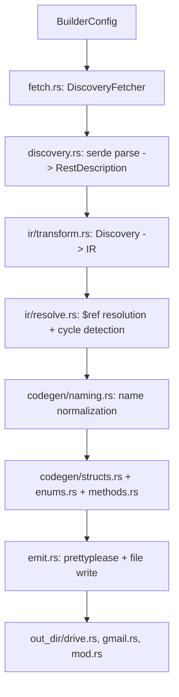

# gws-builder: Static Rust Codegen from Google Discovery Documents

## Context

The [Google Workspace CLI](https://github.com/googleworkspace/cli) handles Discovery documents **dynamically at runtime** -- it deserializes JSON into generic serde types and builds `clap::Command` trees on the fly. The `gws-builder` crate takes the opposite approach: it runs at **compile time** (inside `build.rs`) to produce static, strongly-typed Rust code from the same Discovery documents.

The Discovery document format is well-defined (see [Google Discovery Service](https://developers.google.com/discovery)). Each document contains:

- `schemas`: JSON Schema type definitions (structs, enums, maps, nested objects)
- `resources`: REST resources with `methods` containing HTTP verb, path template, parameters, request/response `$ref` links
- `parameters`: global query parameters
- `auth`: OAuth2 scope definitions

## Crate Layout

```
src/
  lib.rs           -- Public API (BuilderConfig, generate())
  error.rs         -- BuilderError with thiserror
  fetch.rs         -- Blocking HTTP fetch + directory resolution
  discovery.rs     -- Serde models for Discovery JSON (borrowed from GWS CLI)
  ir.rs            -- IR module root
  ir/
    types.rs       -- IR type definitions (IrSchema, IrField, IrMethod, IrEnum...)
    resolve.rs     -- $ref resolution, cycle detection, topological sort
    transform.rs   -- Discovery -> IR transformation
  codegen.rs       -- Code generation module root
  codegen/
    structs.rs     -- Struct + field emission with serde derives
    enums.rs       -- String enum emission
    methods.rs     -- Method signature + endpoint metadata emission
    naming.rs      -- camelCase->snake_case, Rust keyword escaping, collision detection
  emit.rs          -- File writing, prettyplease formatting, module tree
```

The crate type should be `lib` (not `bin`). Change `src/main.rs` to `src/lib.rs`.

---

## Module 1: Public API (`[src/lib.rs](src/lib.rs)`)

```rust
pub struct ServiceSpec {
    pub name: String,      // e.g. "drive"
    pub version: String,   // e.g. "v3"
}

pub struct BuilderConfig {
    pub services: Vec<ServiceSpec>,
    pub out_dir: PathBuf,
    pub fetcher: Option<Box<dyn DiscoveryFetcher>>,  // injectable for testing
}

pub fn generate(config: BuilderConfig) -> Result<(), BuilderError> { ... }
```

- The `fetcher` field defaults to the real HTTP fetcher but can be replaced with a mock in tests.
- `generate()` orchestrates: fetch -> parse -> IR transform -> codegen -> emit.

---

## Module 2: Error Handling (`[src/error.rs](src/error.rs)`)

Use `thiserror` with structured variants:

```rust
#[derive(Debug, thiserror::Error)]
pub enum BuilderError {
    #[error("network fetch failed for {service}/{version}: {source}")]
    Fetch { service: String, version: String, source: Box<dyn std::error::Error + Send + Sync> },

    #[error("failed to parse Discovery document for {service}: {source}")]
    Parse { service: String, source: serde_json::Error },

    #[error("schema resolution error: {0}")]
    Resolution(String),

    #[error("code generation error: {0}")]
    Codegen(String),

    #[error("file I/O error writing to {path}: {source}")]
    Io { path: PathBuf, source: std::io::Error },
}
```

No `unwrap()` anywhere -- all fallible operations return `Result<T, BuilderError>`.

---

## Module 3: Discovery Fetcher (`[src/fetch.rs](src/fetch.rs)`)

```rust
pub trait DiscoveryFetcher {
    fn fetch_document(&self, service: &str, version: &str) -> Result<String, BuilderError>;
}

pub struct HttpFetcher;  // uses ureq (blocking, no tokio needed in build.rs)
```

- **Directory resolution**: First hits `https://www.googleapis.com/discovery/v1/apis` to verify the service/version exists and get the canonical `discoveryRestUrl`.
- **Primary URL**: `https://www.googleapis.com/discovery/v1/apis/{service}/{version}/rest`
- **Fallback URL**: `https://{service}.googleapis.com/$discovery/rest?version={version}` (newer APIs like Forms, Keep, Meet use this pattern).
- **Input validation**: Only allow `[a-zA-Z0-9._-]` in service/version strings (matches GWS CLI's `validate_api_identifier`).
- Use `ureq` instead of `reqwest::blocking` -- it has no native TLS dependency headaches and is lighter for build scripts.

---

## Module 4: Discovery Serde Models (`[src/discovery.rs](src/discovery.rs)`)

Port the serde structs from the GWS CLI's `[crates/google-workspace/src/discovery.rs](https://github.com/googleworkspace/cli/blob/main/crates/google-workspace/src/discovery.rs)`, but make them owned (no lifetimes) and add missing fields found in the real Discovery docs:

Key types: `RestDescription`, `RestResource`, `RestMethod`, `SchemaRef`, `MethodParameter`, `JsonSchema`, `JsonSchemaProperty`, `MediaUpload`, `AuthDescription`.

**Important additions** vs the GWS CLI models:

- `annotations` field on `JsonSchemaProperty` (Gmail uses `annotations.required`)
- `deprecated` field on `JsonSchema` (top-level schema deprecation)
- `canonicalName` on `RestDescription` (used for cleaner module naming)

---

## Module 5: Intermediate Representation (`[src/ir/](src/ir/)`)

### 5a. IR Types (`[src/ir/types.rs](src/ir/types.rs)`)

```rust
pub enum IrType {
    String,
    I32,
    I64,                           // Note: serialized as string in JSON!
    U32,
    U64,                           // serialized as string in JSON
    F32,
    F64,
    Bool,
    Bytes,                         // base64-encoded
    DateTime,
    Date,
    Any,                           // serde_json::Value
    Array(Box<IrType>),
    Map(Box<IrType>),              // HashMap<String, T>
    Ref(String),                   // named schema reference
    Struct(IrStruct),              // inline anonymous struct
    Enum(IrEnum),                  // string enum
}

pub struct IrStruct {
    pub name: String,
    pub doc: Option<String>,
    pub fields: Vec<IrField>,
    pub is_recursive: bool,        // needs Box<Self> somewhere
}

pub struct IrField {
    pub original_name: String,     // camelCase from JSON
    pub rust_name: String,         // snake_case for Rust
    pub doc: Option<String>,
    pub field_type: IrType,
    pub required: bool,
    pub read_only: bool,
    pub deprecated: bool,
    pub default_value: Option<String>,
}

pub struct IrEnum {
    pub name: String,
    pub doc: Option<String>,
    pub variants: Vec<IrEnumVariant>,
}

pub struct IrEnumVariant {
    pub original_value: String,
    pub rust_name: String,
    pub doc: Option<String>,
}

pub struct IrMethod {
    pub id: String,                // e.g. "drive.files.list"
    pub rust_name: String,
    pub doc: Option<String>,
    pub http_method: String,
    pub path_template: String,
    pub path_params: Vec<IrField>,
    pub query_params: Vec<IrField>,
    pub request_type: Option<IrType>,
    pub response_type: Option<IrType>,
    pub scopes: Vec<String>,
    pub supports_media_upload: bool,
    pub supports_media_download: bool,
    pub deprecated: bool,
}

pub struct IrService {
    pub name: String,
    pub version: String,
    pub doc: Option<String>,
    pub base_url: String,
    pub structs: Vec<IrStruct>,
    pub enums: Vec<IrEnum>,
    pub resources: Vec<IrResource>,
}

pub struct IrResource {
    pub name: String,
    pub rust_name: String,
    pub methods: Vec<IrMethod>,
    pub sub_resources: Vec<IrResource>,
}
```

### 5b. $ref Resolution and Cycle Detection (`[src/ir/resolve.rs](src/ir/resolve.rs)`)

- Build a dependency graph from schema `$ref` pointers.
- Detect cycles using DFS with a visited set (e.g., `MessagePart.parts -> MessagePart`).
- For cyclic references, mark the field as needing `Box<T>`.
- **Topological sort** the schemas for emission order (non-cyclic schemas first).
- Resolve inline `additionalProperties` and `items` recursively.

### 5c. Discovery to IR Transform (`[src/ir/transform.rs](src/ir/transform.rs)`)

The core mapping logic:

**Type mapping table:**


| Discovery `type`                       | Discovery `format` | IR Type                      | Rust Output                                     |
| -------------------------------------- | ------------------ | ---------------------------- | ----------------------------------------------- |
| `string`                               | (none)             | `IrType::String`             | `String`                                        |
| `string`                               | `int64`            | `IrType::I64`                | `i64` (with `#[serde(deserialize_with = ...)]`) |
| `string`                               | `uint64`           | `IrType::U64`                | `u64` (string-serialized)                       |
| `string`                               | `byte`             | `IrType::Bytes`              | `Vec<u8>` (base64)                              |
| `string`                               | `date-time`        | `IrType::DateTime`           | `String` (or chrono type)                       |
| `string`                               | `date`             | `IrType::Date`               | `String`                                        |
| `integer`                              | `int32`            | `IrType::I32`                | `i32`                                           |
| `integer`                              | `uint32`           | `IrType::U32`                | `u32`                                           |
| `number`                               | `float`            | `IrType::F32`                | `f32`                                           |
| `number`                               | `double`           | `IrType::F64`                | `f64`                                           |
| `boolean`                              | (none)             | `IrType::Bool`               | `bool`                                          |
| `any`                                  | (none)             | `IrType::Any`                | `serde_json::Value`                             |
| `array`                                | (none)             | `IrType::Array(items)`       | `Vec<T>`                                        |
| `object` + `properties`                | --                 | `IrType::Struct(...)`        | named struct                                    |
| `object` + `additionalProperties` only | --                 | `IrType::Map(value_type)`    | `HashMap<String, T>`                            |
| `object` + both                        | --                 | struct + `#[serde(flatten)]` | struct with extra map                           |
| (none) + `$ref`                        | --                 | `IrType::Ref(name)`          | reference to named type                         |


**Inline object handling**: When a property has `type: "object"` with `properties` but no `$ref`, generate an anonymous struct. Name it by joining the parent schema name + field name in PascalCase (e.g., `About` schema, `storageQuota` field -> `AboutStorageQuota` struct).

**Enum extraction**: When a `string` property has an `enum` array, generate a dedicated Rust enum. Name it similarly: `DelegateVerificationStatus`.

---

## Module 6: Code Generation (`[src/codegen/](src/codegen/)`)

### 6a. Naming (`[src/codegen/naming.rs](src/codegen/naming.rs)`)

- `to_snake_case(camelCase)` -> `snake_case` for fields and methods
- `to_pascal_case(name)` -> `PascalCase` for types
- **Keyword escaping**: `type` -> `r#type`, `ref` -> `r#ref`, `self` -> `r#self`, `mod` -> `r#mod`, etc. Full list of Rust 2024 reserved words.
- **Collision detection**: If two camelCase names produce the same snake*case, append a numeric suffix or use `raw`* prefix. Log a warning.

### 6b. Struct Emission (`[src/codegen/structs.rs](src/codegen/structs.rs)`)

Use `quote` + `proc_macro2` to emit:

```rust
/// {doc from Discovery description}
#[derive(Debug, Clone, Default, serde::Serialize, serde::Deserialize)]
#[serde(rename_all = "camelCase")]
pub struct File {
    /// {field description}
    #[serde(skip_serializing_if = "Option::is_none")]
    pub name: Option<String>,

    /// {field description}
    #[serde(skip_serializing_if = "Option::is_none")]
    pub parents: Option<Vec<String>>,

    /// {field description, recursive}
    #[serde(skip_serializing_if = "Option::is_none")]
    pub children: Option<Box<Vec<FileChild>>>,
}
```

- Almost all fields should be `Option<T>` since Discovery docs rarely mark fields as `required`.
- Fields with `readOnly: true` still appear (needed for deserialization).
- Fields with `deprecated: true` get `#[deprecated]`.
- The `#[serde(rename = "originalName")]` is only needed when `rename_all = "camelCase"` does not match the original name (e.g., names with underscores or acronyms).
- `format: "int64"` fields need `#[serde(default, deserialize_with = "crate::serde_helpers::string_to_i64")]`.

### 6c. Enum Emission (`[src/codegen/enums.rs](src/codegen/enums.rs)`)

```rust
/// Verification status of a delegate.
#[derive(Debug, Clone, PartialEq, Eq, serde::Serialize, serde::Deserialize)]
pub enum DelegateVerificationStatus {
    #[serde(rename = "verificationStatusUnspecified")]
    VerificationStatusUnspecified,
    #[serde(rename = "accepted")]
    Accepted,
    // ...
}
```

- Include an `Unknown(String)` variant via `#[serde(other)]` or a custom deserializer for forward compatibility.
- Pair `enumDescriptions` with variants as doc comments.

### 6d. Method Metadata (`[src/codegen/methods.rs](src/codegen/methods.rs)`)

Generate method descriptor structs or constants:

```rust
pub mod files {
    pub struct ListRequest {
        pub page_size: Option<i32>,
        pub page_token: Option<String>,
        pub q: Option<String>,
        // ...
    }

    pub const LIST: MethodDescriptor = MethodDescriptor {
        http_method: "GET",
        path_template: "files",
        scopes: &["https://www.googleapis.com/auth/drive", ...],
    };
}
```

---

## Module 7: File Emission (`[src/emit.rs](src/emit.rs)`)

- Format all `TokenStream` output through `prettyplease::unparse()` for human-readable code.
- Write one file per service: `{out_dir}/drive.rs`, `{out_dir}/gmail.rs`, etc.
- Write a root `mod.rs`:
  ```rust
  pub mod drive;
  pub mod gmail;
  ```
- Use `std::fs::write` atomically (write to temp file, then rename).

---

## Dependency Profile (`[Cargo.toml](Cargo.toml)`)

```toml
[package]
name = "gws-builder"
version = "0.1.0"
edition = "2024"

[dependencies]
serde = { version = "1", features = ["derive"] }
serde_json = "1"
ureq = { version = "3", features = ["json"] }
quote = "1"
proc-macro2 = "1"
syn = "2"
thiserror = "2"
prettyplease = "0.2"
heck = "0.5"          # camelCase/snake_case/PascalCase conversion
```

Note: `ureq` v3 is the current version (uses rustls by default, no OpenSSL). `heck` handles naming conventions correctly.

---

## Potential Logic Faults (identified)

### 1. Recursive Schemas (Critical)

`MessagePart.parts` in Gmail contains `$ref: "MessagePart"`. Without `Box<T>`, this produces an infinitely-sized type. The IR resolver **must** detect cycles and insert `Box<>` wrapping.

**Mitigation**: DFS cycle detection in `resolve.rs`. When a cycle is found, mark the edge field with `is_boxed = true`.

### 2. `string` with `format: "int64"` (Critical)

Google serializes 64-bit integers as JSON strings to avoid JavaScript precision loss. Naive deserialization as `i64` will fail because serde expects a JSON number.

**Mitigation**: Generate a custom `#[serde(deserialize_with = "...")]` attribute for these fields. Ship a `serde_helpers` module with the generated code containing `string_to_i64`, `string_to_u64` helper functions.

### 3. Inline Anonymous Objects (Medium)

Properties like `About.storageQuota` define `type: "object"` with `properties` inline, without a `$ref`. These need struct names synthesized from context.

**Mitigation**: Name as `{ParentSchema}{FieldPascalCase}`. Track generated names in a set to detect collisions.

### 4. `additionalProperties` + `properties` Coexistence (Medium)

When both exist on the same object, you need a struct with known fields PLUS a `#[serde(flatten)] pub extra: HashMap<String, T>`. This is subtle.

**Mitigation**: Check for both in `transform.rs` and generate the flatten field.

### 5. Rust Keyword Conflicts (Medium)

Field names like `type` (used in every schema!) are Rust keywords. `serde(rename)` handles serialization, but the Rust field name itself must be valid.

**Mitigation**: Maintain a keyword set. Rename `type` -> `r#type` or `type_` with `#[serde(rename = "type")]`. Prefer the `r#` raw identifier syntax for Rust 2024 compatibility.

### 6. camelCase to snake_case Collisions (Low)

Edge case: `fooBar` and `foo_bar` both map to `foo_bar`. Or `ABCDef` and `abcDef`.

**Mitigation**: After conversion, check for duplicates within a struct. Append `_1`, `_2` suffixes if collisions occur. Emit a `cargo:warning=` message.

### 7. Network Failure in build.rs (Medium)

Build scripts that require network are fragile. CI without internet, corporate firewalls, etc.

**Mitigation**: Support a `cache_dir` option in `BuilderConfig`. On successful fetch, write the raw JSON to `cache_dir`. On network failure, fall back to cached copy. Emit `cargo:warning=` when using stale cache.

### 8. Empty/Marker Schemas (Low)

Some schemas have no properties at all (e.g., `Empty` in many Google APIs). These should still produce valid empty structs.

### 9. `type: "any"` Loss of Type Safety (Low)

Maps to `serde_json::Value`. Unavoidable, but should be documented in the generated code's doc comment.

### 10. Enum Variant Name Validity (Low)

Enum values like `verificationStatusUnspecified` need PascalCase conversion. Some enum values might start with digits or contain special characters.

**Mitigation**: Sanitize variant names through `heck::ToPascalCase` and prepend `_` for digit-leading names.

### 11. Schema Name Collisions Across Services (Non-issue)

Each service gets its own module file, so `drive::File` and `gmail::Message` never collide.

### 12. Thread Safety of `ureq` in build.rs (Non-issue)

`build.rs` runs single-threaded. Sequential fetches are fine.

---

## Testing Strategy

### Unit Tests (per module)

- `**naming`: Table-driven tests for camelCase->snake_case, keyword escaping, collision detection
- `**discovery`**: Parse fixture JSON files (saved from real Discovery docs) into serde types
- `**transform**`: Convert known Discovery fragments -> IR, assert field types, names, optionality
- `**resolve**`: Test cycle detection with hand-crafted cyclic schema graphs
- `**structs/enums**`: Compare `quote!` output `TokenStream` `.to_string()` against expected strings
- `**emit**`: Write to a temp dir, verify file contents and module tree structure

### Integration Tests (`tests/`)

- **Snapshot tests**: Fetch real Discovery docs for Drive v3 and Gmail v1 (cached as fixture files in `tests/fixtures/`), run full pipeline, compare output against golden files using `insta` or manual diff
- **Compile-check test**: Generate code into a temp directory, then `include!()` it in a test and verify it compiles and the types are usable

### Fixture Files (`tests/fixtures/`)

- `drive_v3.json` -- saved from `https://www.googleapis.com/discovery/v1/apis/drive/v3/rest`
- `gmail_v1.json` -- saved from `https://www.googleapis.com/discovery/v1/apis/gmail/v1/rest`
- `minimal.json` -- hand-crafted minimal Discovery doc for fast unit tests
- `recursive.json` -- hand-crafted doc with cyclic `$ref` for cycle detection tests
- `edge_cases.json` -- doc with `additionalProperties`, inline objects, `format: "int64"`, enums, `type: "any"`

### Property-Based Testing

Consider `proptest` or `quickcheck` for the naming module -- generate random strings and verify snake_case/PascalCase never produces invalid Rust identifiers.

---

## Pipeline Flow




## Key Design Decisions

- `**ureq` over `reqwest::blocking**`: Lighter dependency, pure Rust TLS, no tokio runtime needed in `build.rs`.
- **Trait-based fetcher**: `DiscoveryFetcher` trait allows injecting mock HTTP responses in tests without network.
- **IR layer**: Decouples parsing from codegen. Discovery format changes only affect `transform.rs`. Rust codegen changes only affect `codegen/`.
- `**prettyplease`: Ensures generated code is readable and diff-friendly without requiring `rustfmt` to be installed.
- `**heck`**: Battle-tested case conversion library; no hand-rolled regex.
- **All fields `Option<T>`**: Matches Google's schema where almost nothing is truly required. Prevents deserialization failures on partial responses.

---

name: gws-builder crate plan  
overview: "Build the `gws-builder` crate: a build-time dependency that fetches Google Discovery documents and transpiles them into idiomatic Rust 2024 source code with structs, enums, and typed method signatures."  
todos:

- id: scaffold  
content: "Scaffold crate: convert main.rs to lib.rs, update Cargo.toml with all dependencies, create module files"  
status: pending
- id: error
content: Implement BuilderError enum in error.rs with thiserror
status: pending
- id: discovery-types
content: Port and extend Discovery serde models in discovery.rs (from GWS CLI, add missing fields)
status: pending
- id: fetch
content: Implement DiscoveryFetcher trait + HttpFetcher with ureq, input validation, fallback URLs, caching
status: pending
- id: ir-types
content: Define IR types (IrType, IrStruct, IrField, IrEnum, IrMethod, IrService, IrResource)
status: pending
- id: ir-resolve
content: Implement $ref resolution with DFS cycle detection, topological sort, Box insertion for recursive types
status: pending
- id: ir-transform
content: Implement Discovery -> IR transformation with full type mapping table, inline object naming, enum extraction
status: pending
- id: naming
content: "Implement naming module: camelCase->snake_case, PascalCase, keyword escaping, collision detection"
status: pending
- id: codegen-structs
content: "Implement struct emission with quote: derives, serde attributes, Option wrapping, Box for recursive, int64 helpers"
status: pending
- id: codegen-enums
content: Implement enum emission with Unknown variant for forward compatibility
status: pending
- id: codegen-methods
content: Implement method descriptor emission with path templates, parameters, scopes
status: pending
- id: emit
content: "Implement file emission: prettyplease formatting, per-service files, mod.rs generation, atomic writes"
status: pending
- id: public-api
content: "Wire up lib.rs: BuilderConfig, generate() function orchestrating the full pipeline"
status: pending
- id: fixtures
content: Create test fixture JSON files (minimal, recursive, edge_cases, real Drive/Gmail cached docs)
status: pending
- id: tests
content: Write unit tests for each module + integration snapshot tests + compile-check test
status: pending
isProject: false

---

